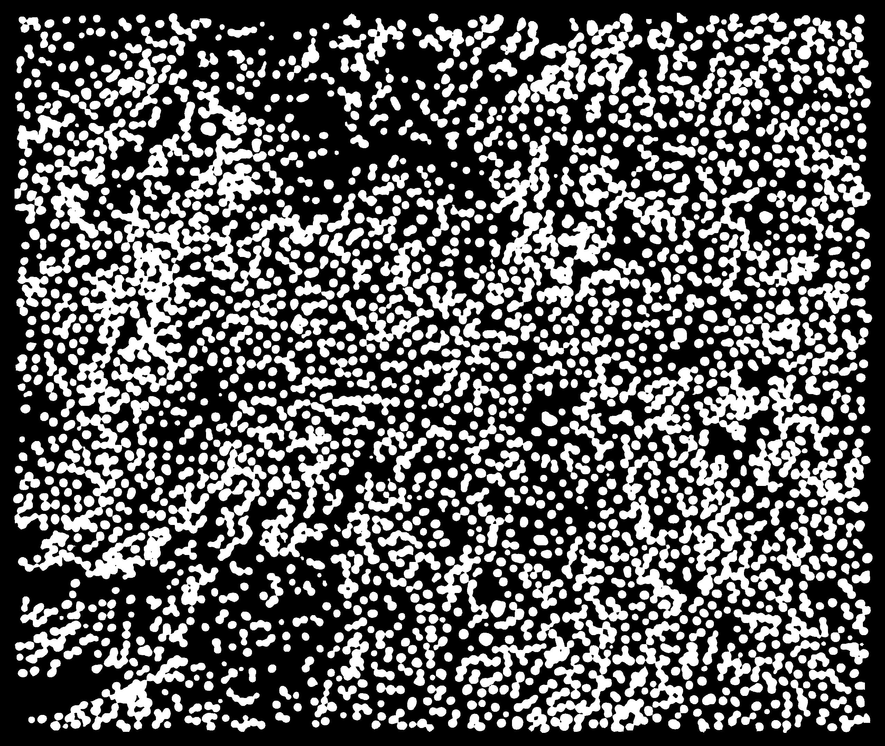
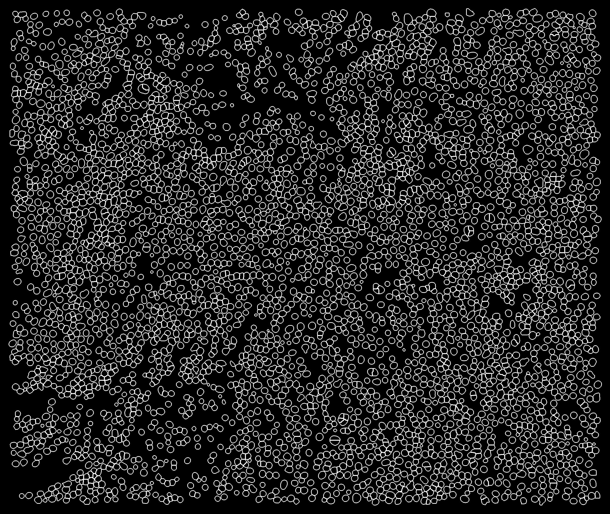
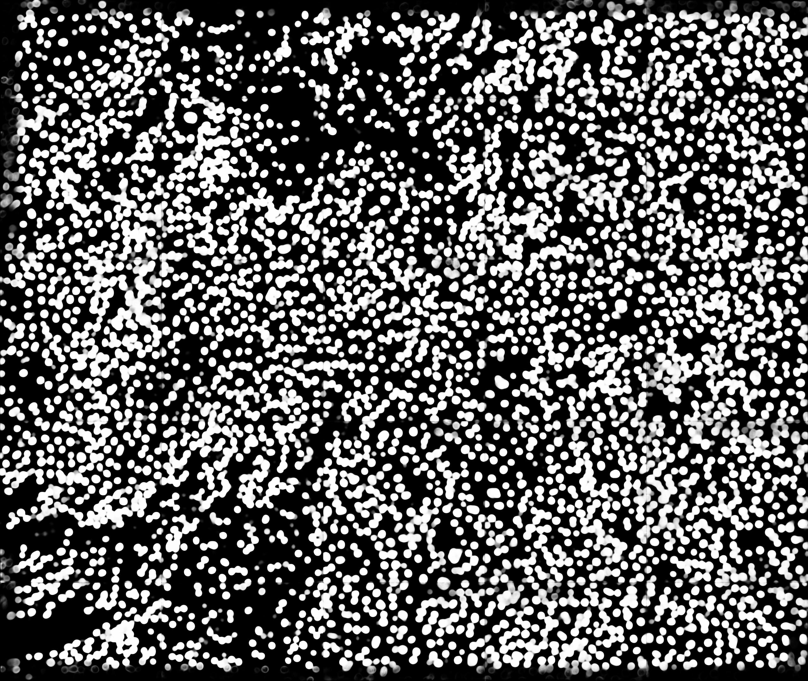
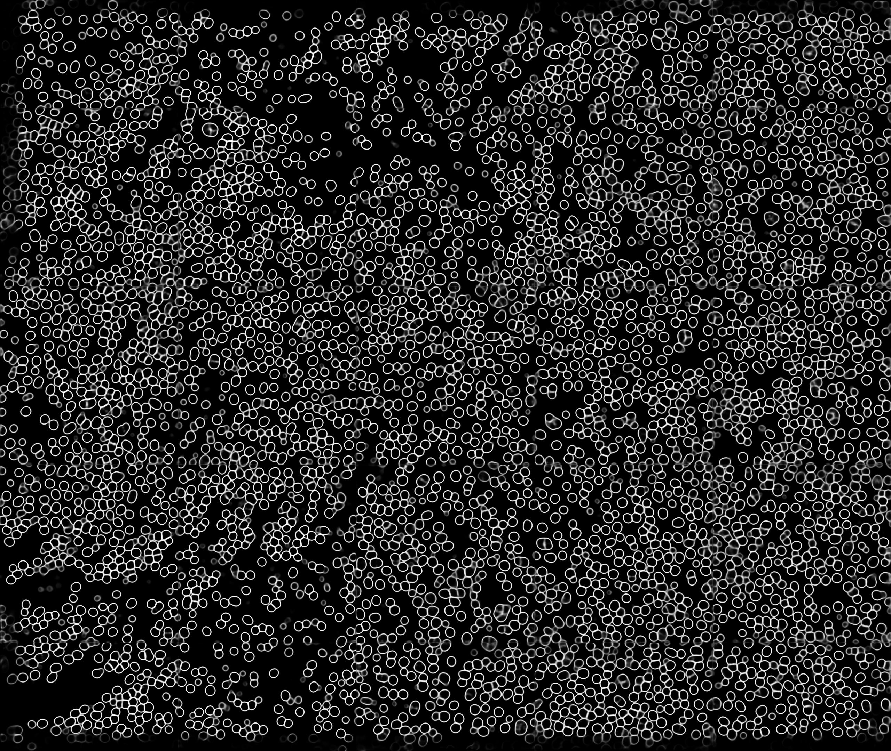

# Automated instance segmentation of nuclei in DAPI fluorescent stained slide images from photoimmunotherapy clinical trial
An pytorch implementation of Attention U-Net architecture for nuclei segmentation in DAPI stained WSI's

# Project structure

 * [extractor_class](extractor_class) : *Contains patch extractors*
	 * [label_map_patchextractor.py](extractor_class/label_map_patchextractor.py) : *Label map KI67 and FOXP3 patch extractor*
   * [patch_extractor.py](extractor_class/patch_extractor.py) : *DAPI and GT patch extractor*
 * [Generators](Generators)
	 * [DatasetTorch.py](Generators/DatasetTorch.py) 
 * [Models](Models)
 * [Results](Results)
 * [Utils](Utils)
	 * [generate_gt_masks.py](Utils/generate_gt_masks.py)  : *Converts n-array mask to nuclei and boundary binary maps*
	 * [GenerateSeeds.py](Utils/GenerateSeeds.py) : *Produces nuclei seeds only from trained model*
	 *  [Predicition.py](Utils/Predicition.py) : *Returns raw predictions*
	 *  [Preprocess.py](Utils/Preprocess.py)  : *Offline preprocessing steps applied before training and testing*
 * [Losses.py](Losses.py)
 * [README.md](./README.md)
 * [test.py](test.py)
 * [train.py](train.py)
 

# Results
Some Sample Result, you can refer to the [Results/](Results/) folder for **details**.

  
  **GT Nuclei**

  
   **GT Boundary**
   
  **Predictions Nuclei**

  
   **Predictions Boundary**

# Implementation details

**Library** : Pytorch version 1.3.1 
**GPU** : Tesla V100-SXM2-32GB 
**Number of epochs** : 10 

 
